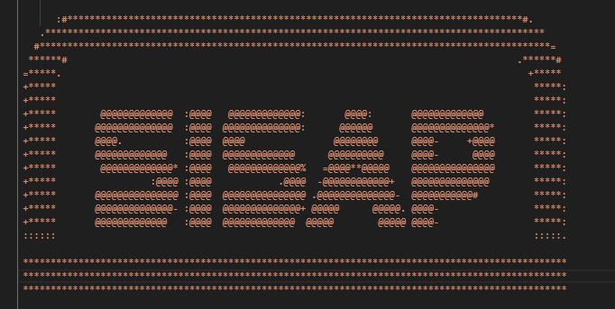

# 🧾 Sistema Automatizado de Facturación y Gestión de Usuarios para Tiendas Minoristas



> Proyecto Integrador – IRSI-SISAP | Curso de Scripting  
> Desarrollado por: Josué

---

## 🎯 Objetivo del Proyecto

Automatizar el proceso de facturación electrónica y gestión de usuarios temporales en una cadena de tiendas minoristas.  
Este sistema modular y multiplataforma combina scripts en **Python**, **Bash**, **PowerShell** y **LaTeX**, simulando un entorno real de producción con generación de logs, validaciones, envío automatizado de correos y control de errores.

---

## ⚙️ Estructura del Proyecto

```plaintext
proyecto_facturacion_irsis_sisap/
│
├── scripts_python/              → Scripts en Python para generación y envío
│   ├── generador_compras.py
│   ├── enviador.py
│   └── generador_empleados.py
│
├── scripts_bash/                → Scripts Bash para automatización y facturas
│   ├── generador_facturas.sh
│   ├── cron_job.sh
│   └── resumen_diario.sh
│
├── scripts_powershell/          → Gestión de usuarios temporales
│   └── usuarios.ps1
│
├── plantillas_latex/            → Plantillas de facturación en LaTeX
│   └── plantilla_factura.tex
│
├── data/                        → Archivos generados y registros del sistema
│   ├── ventas_YYYYMMDD.csv
│   ├── pendientes_envio.csv
│   ├── empleados.csv
│   ├── log_diario.log
│   ├── log_envios.csv
│   └── log_usuarios.log
│
├── facturas_generadas/          → Facturas generadas en PDF
│   └── factura_XXXX.pdf
│
├── evidencia/                   → Capturas de ejecución y pruebas
│   ├── correo_enviado.png
│   ├── usuario_creado_windows.png
│   ├── factura_ejemplo.png
│   └── cron_configurado.png
│
├── documentacion/               → Reporte final del proyecto
│   ├── reporte_final.pdf
│   └── assets_diagrama/
│       └── flujo_sistema.png
│
└── README.md                    → Este documento
```

---

## 🔁 Flujo General del Sistema

graph TD
    A[Inicio del Día] --> B[generador_compras.py]
    B --> C[ventas_fecha.csv]
    
    C --> D[generador_facturas.sh]
    D --> E[Reemplazo en plantilla LaTeX]
    E --> F[Generar factura PDF]
    F --> G[factura_XXXX.pdf]
    F --> H[log_diario.log]
    F --> I[pendientes_envio.csv]

    I --> J[enviador.py]
    J --> K[Validar correos]
    J --> L[Enviar correo con PDF]
    J --> M[log_envios.csv]
    J --> N[Actualizar pendientes_envio.csv]

    M --> O[generar_resumen.sh]
    O --> P[Correo resumen al admin]

    Q[empleados.csv] --> R[usuarios.ps1]
    R --> S[Crear usuarios locales]
    R --> T[log_usuarios.log]

    P --> Z[Fin del Día]
    S --> Z


---

## 🛠️ Tecnologías Utilizadas

| Herramienta | Función Principal |
|-------------|-------------------|
| **Python**  | Simulación de datos y envío de correos |
| **Bash**    | Automatización, sed/awk, logs |
| **PowerShell** | Gestión de usuarios locales (Windows) |
| **LaTeX**   | Facturación profesional en PDF |
| **cron / Task Scheduler** | Automatización por hora/día |
| **awk**     | Análisis de logs y estadísticas |

---

## 🧩 Descripción de Módulos

### 🔹 Python

- `generador_compras.py`: Simula transacciones de clientes (con Faker), genera CSV por lote.
- `enviador.py`: Lee `pendientes_envio.csv`, valida correos, envía facturas y actualiza logs.
- `generador_empleados.py` *(opcional)*: Genera `empleados.csv` para pruebas de PowerShell.

### 🔹 Bash

- `generador_facturas.sh`: Reemplaza campos en `.tex` usando `sed`, compila con `pdflatex` y genera logs.
- `cron_job.sh`: Script maestro para automatizar todo con `cron`.
- `resumen_diario.sh`: Usa `awk` sobre `log_envios.csv` para resumir ventas, errores y resultados.

### 🔹 PowerShell

- `usuarios.ps1`: Crea cuentas de usuarios temporales en Windows desde `empleados.csv` (con contraseñas seguras).

### 🔹 LaTeX

- `plantilla_factura.tex`: Contiene placeholders como `{nombre}`, `{monto}`, `{correo}`, etc., reemplazados dinámicamente.

---

## 📄 Documentación del Proyecto

Toda la documentación técnica, capturas, fragmentos de código, logs y reflexiones se encuentran en:

📁 `documentacion/reporte_final.pdf`

Incluye:

- Introducción al problema
- Arquitectura y diagrama de flujo
- Desarrollo de módulos
- Evidencias gráficas
- Apéndice con código fuente completo
- Conclusión y resolución de problemas

---

## 📬 Flujo Diario Programado

| Hora | Acción Automática | Script |
|------|-------------------|--------|
| 00:00 | Generar datos de ventas simuladas | `generador_compras.py` |
| 01:00 | Generar facturas en PDF | `generador_facturas.sh` |
| 02:00 | Enviar facturas por correo electrónico | `enviador.py` |
| 02:15 | Generar resumen del día y enviarlo | `resumen_diario.sh` |
| En cualquier momento | Crear usuarios desde CSV | `usuarios.ps1` |

---

## 📷 Evidencia de Funcionamiento

- 📎 Correos enviados con PDF adjunto
- 📎 Capturas de cron configurado
- 📎 Usuarios creados en Windows
- 📎 Facturas generadas correctamente
- 📎 Logs detallados de cada módulo

---

## ✅ Buenas Prácticas Aplicadas

- Estructura modular por lenguaje
- Variables dinámicas (nunca hardcodeadas)
- Logs detallados para cada proceso
- Validaciones robustas (regex, errores de conexión)
- Separación total entre datos, scripts y documentos
- Cumplimiento del reglamento de entrega (PDF integrado)

---

## 🧠 Autores del Proyecto

| Nombre  | Rol Principal |
|---------|----------------|
| Josué   | Simulación de datos (Python), logs |
| Josué   | Automatización Bash, facturación LaTeX |
| Josué   | Gestión de usuarios (PowerShell), validación cruzada |

---

## 🚀 Estado del Proyecto

- [x] Generación de compras simuladas  
- [x] Facturación automática y validada  
- [x] Envío de facturas por correo  
- [x] Creación de cuentas desde CSV  
- [x] Automatización con cron  
- [x] Reporte final en PDF completo  

---

## 📢 Licencia

Proyecto académico desarrollado para fines educativos en el curso de **Scripting – IRSI-SISAP**.  
Se permite reutilización con fines didácticos siempre que se dé el crédito correspondiente.

---


